### Solución examen #1
**Universidad ICESI**  
**Curso:** Sistemas Operativos  
**Docente:** Daniel Barragán C.  
**Tema:** Comandos de Linux, Virtualización  
**Correo:** daniel.barragan at correo.icesi.edu.co  
**Estudiante:** Jhon Eduar Tobar Gómez  
**Código:** A00316212  
**URL GitHub:** https://github.com/Jhongomez6/so-exam1 

### Objetivos
* Conocer y emplear comandos de Linux para la realización de tareas administrativas
* Virtualizar un sistema operativo
* Conocer y emplear capacidades de CentOS7 para la vitualización

### Prerrequisitos
* Virtualbox o WMWare
* Máquina virtual con sistema operativo CentOS7

### Descripción
El primer parcial del curso sistemas operativos trata sobre el manejo de los comandos de Linux, virtualización y el uso de las características de CentOS7

### Actividades

1. Resuelva los siguienes retos de la página https://cmdchallenge.com y presente la solución a cada uno de ellos a través de un ejemplo práctico en CentOS7. Presente capturas de pantalla relevantes como evidencias de lo realizado (20%)
  * sum_all_numbers
  * replace_spaces_in_filenames
  * reverse_readme
  * remove_duplicated_lines
  * disp_table
  
 2. Realice un script que cumpla las condiciones que se describen a continuación. Presente capturas de pantalla relevantes como evidencias del funcionamiento (30%)
   * El usuario gutenberg debe existir en el sistema operativo
   * El script se debe ejecutar cada 5 minutos, consulte el manual de crontab
   * EL script debe descargar un libro del proyecto https://www.gutenberg.org/ en el directorio /home/gutenberg/mybooks
   * Si ya existe un libro en el directorio mybooks, debe ser reemplazado
   
3. Describa el funcionamiento del código fuente rickroll.c del repositorio de github https://github.com/jvns/kernel-module-fun. Muestre el funcionamiento al compilar el código y cargarlo como un módulo del kernel a través de un video que deberá cargar en Youtube e incluir el enlace en el informe (30%). Se recomienda emplear el sistema operativo Ubuntu con interfaz gráfica para esta prueba.
  
  ### **Primera actividad: solución retos cmdchallenge**
 
  
  En este punto se resuelven 5 retos de la pagina https://cmdchallenge.com y se comprueba que la solución mediante un ejemplo practico en centOS7. 
  
 **Primer reto:** sum_all_numbers
 
 Para el primer reto, se tiene una lista de numeros en un archivo de texto plano, los cuales deben ser sumados y mostrar el resultado de dicha operación.

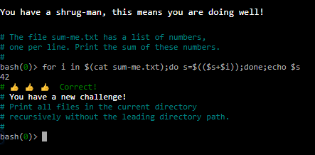
 
 Ahora bien, utilizando este mismo comando, lo aplicamos mediante un ejemplo basico en centOS7:
 
 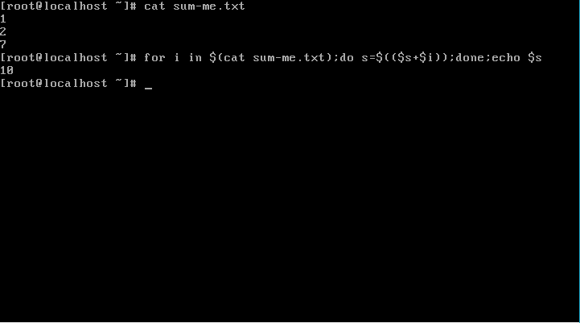
 
 Podemos evidenciar que la suma de los numeros del archivo de texto se hace correctamente.

**Segundo reto:** replace_spaces_in_filenames

En el segundo reto se tienen distintos archivos en un directorio en los cuales los nombres de dichos archivos contienen espacios. Para cumplir el reto se deben reemplazar todos los espacios de dichos nombres de archivos por puntos.

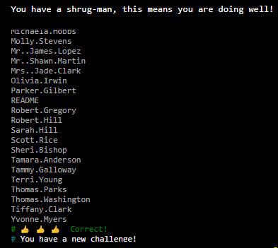

Aplicamos el mismo comando en CentOS7:

Vemos que hay distintos archivos nombrados con nombres y apellidos separados por espacios y el resultado efectivamente es que se cambian los espacios por puntos.

**Tercer reto:** reverse_readme
  
  Para cumplir el tercer reto se debe invertir el orden en que se imprime un archivo README. Es decir, la ultima linea debe quedar como la primera y la primera como la ultima.
  
  Evidencia del cumplimiento del reto en cmdchallenge.com::
  
  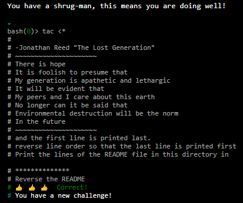
  
  Ahora se implementa la solución en CentOS7:
  
  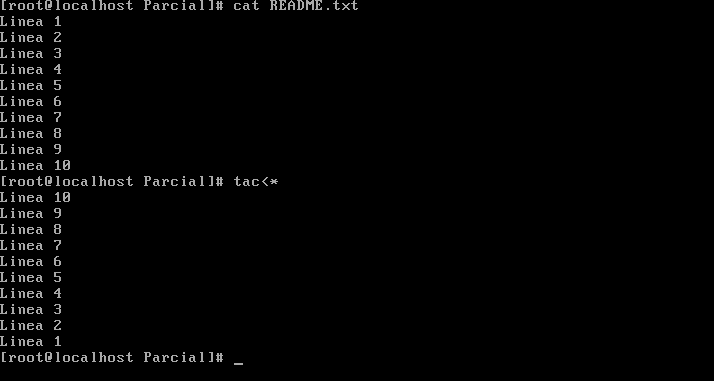
  
  Podemos evidenciar que el orden de impresión de las lineas del archivo se ha invertido correctamente.
  
  **Cuarto reto:** remove_duplicated_lines
  
  Para cumplir este reto se debe eliminar instancias o lineas repetidas de un archivo de texto. Es decir, no debe haber ninguna linea duplicada, solamente se imprime la primera vez que aparece cada linea.
  
  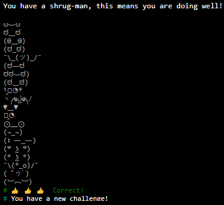
  
  Aplicando el mismo comando en CentOS7 podemos ver que imprime un instancia por cada linea y elimina los duplicados.
  
  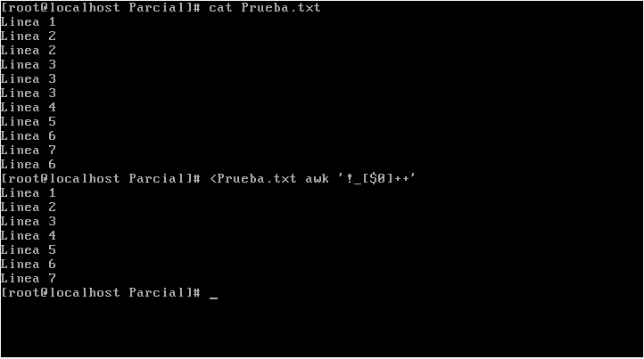
  
  **Quinto reto:**  *disp_table
  
  Por ultimo, tenemos un reto muy sencillo que se trata de tomar un archivo CSV e imprimirlo como un tabla.
  
   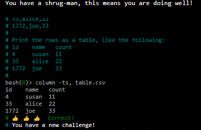
   
   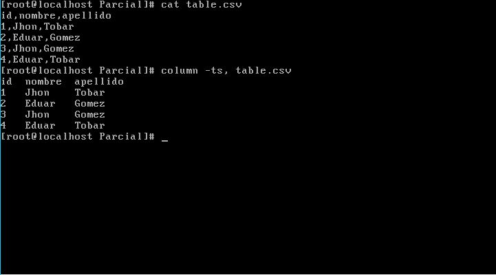
   
    ### ** Segunda actividad: solución script **
    
   En este punto se requiere desarrollar un script que cumpla con las siguientes condiciones:
    
   * El usuario gutenberg debe existir en el sistema operativo
   * El script se debe ejecutar cada 5 minutos, consulte el manual de crontab
   * EL script debe descargar un libro del proyecto https://www.gutenberg.org/ en el directorio /home/gutenberg/mybooks
   * Si ya existe un libro en el directorio mybooks, debe ser reemplazado
   
   La solución propuesta es la siguiente:
   
   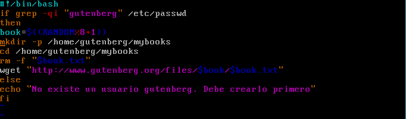
   
   La primera linea del código sirve para verificar si existe un usuario gutenberg en el sistema operativo. Si el usuario existe se continua con la operación, de lo contrario se envia un mensaje de que no existe el usuario y termina.
   
   Primero corremos el script con un usuario gutenberg creado en el sistema operativo y se evidencia que el script descarga satisfactoriamente un libro del portal gutenberg:
   
   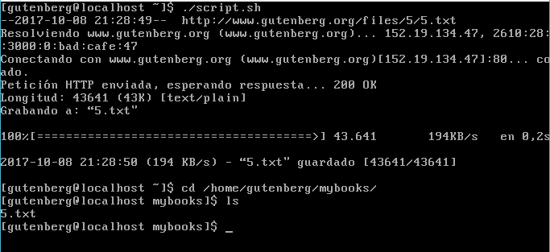
   
   El script lo primero que hace es crear un numero de random que será el identificador del libro y que sirve para crear la ruta de descarga del fichero.
   
   Luego crea un directorio "mybooks" en /home/gutenberg. (Esto con el fin de asegurarnos de que el directorio exista y en el caso de que, lo cree.
   
   En el caso de que exista un archivo con el mismo nombre en el directorio mybooks el script lo borrrará. Esto con el fin de reemplazar el archivo y no crear duplicados.3
   
   Por ultimo, el script descarga el archivo armando la ruta con el identificador del archivo y su respectiva extension .txt
   
   Ahora bien, en el caso de que no exista un usuario gutenberg nos muestra lo siguiente:
   
   
   
   En este punto hemos cumplido con 3 de las 4 condiciones. La unica que falta es que el script se ejecute cada 5 minutos. Para esto empleamos un comando llamado crontab el cual permite programar la ejecución de otros comandos con el fin de automatizar tareas.
   
   
   Las tareas de crontab siguen la siguiente sintaxis: 
   
   * * * * * /bin/ejecutar/script.sh

De izquierda a derecha, los asteriscos representan:
Minutos: de 0 a 59.
Horas: de 0 a 23.
Día del mes: de 1 a 31.
Mes: de 1 a 12.
Día de la semana: de 0 a 6, siendo 0 el domingo.

Teniendo en cuenta esto, lo primero que se debe hacer es ejecutar el comando crontab -e el cual nos permitirá añadir nuestra tarea para que sea automatizada.
   
   
   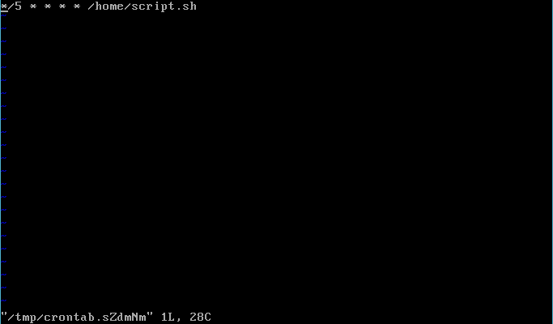
   
   Luego de añadirla y guardar los cambios, podemos evidenciar que la tarea ha sido automatizada y que efectivamente se ejecuta el script cada 5 minutos y nos descarga libros nuevos:
   
   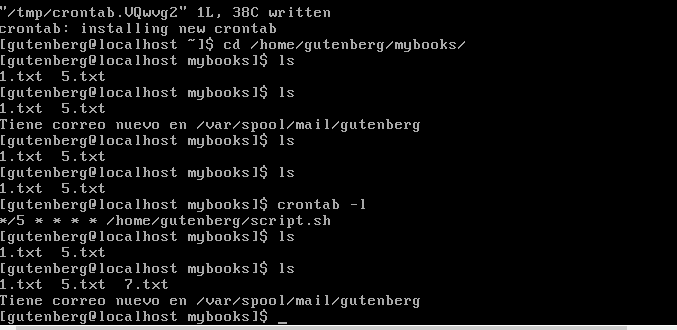
    
  ### ** Tercer actividad : rickroll.c **
    
    
   
   
    
    
 
   
  
  

 
 
 

 
